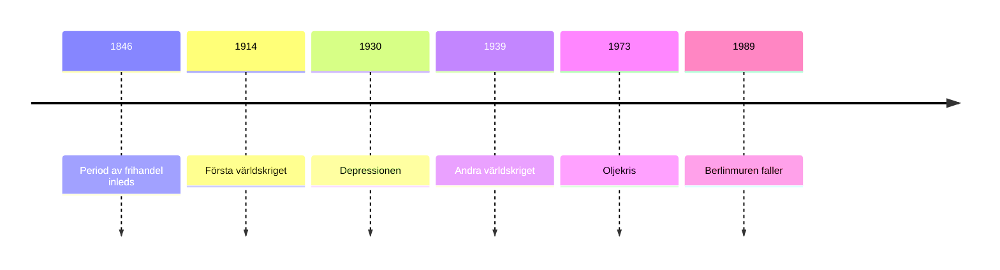

# Ekonomins Historia 
Samhällsekonomin styrs främst av två aktörer:

- Marknaden
- Stat (riksdagen, regering, centralbank)

# Centrala nationalekonomiska teorier

## Merkantilism

Allt är en tävling och ens eget land ska vinna, poängen är att vara oberoende av andra länder och vara rikt. En del av teorin är att jordens rikedomar är inte oändligt därför ska varje land försöka få så mycket som möjligt. Målet är att vara oberoende och därför exportera mer än man importerar. För att kontrollera det här använder man tullar, genom att sätta tullar på billigare utländska saker för att minska mängden vi importerar. Det här leder ju också till att folk försöker smuggla in det dom vill ha, ett exempel är finare tyg mot slutet av 1700-talet.

## Marxism

Dom som arbetar i fabrikerna får ju inte ta del av rikedomarna fabriken får. Det finns två sätt för ekonomin att funka, mycket stat som ena och lite stat som andra. Marxismen menar att klyftan mellan arbetar och fabriksägarna är orättvist och att fabriksarbetarna kommer göra uppror mot ägarna.

## Keynesianism

Staten mer än liberalismen, han tyckte att staten skulle bestämma mer under lågkonjunktur, och bestämma mindre under högkonjuktur. Den här ideologin ligger mellan de två sidorna. 

## Monetarism

Sänka företagsskatten gör att ekonomin växer när företag går bra, därför också om det börjar gå dåligt så kommer med lägre skatter och bidrag och sådant låta företagen anställa fler när det behövs, och därför borde ekonomin gå bra.

## Klassisk ekonomisk liberalism

Det handlar om att staten inte ska störa ekonomin, och att målet är att folket ska få sina behov uppfyllda. Det ska också göra så att ekonomin är obegränsad och växer på ett rimligt sätt. När folk kan sälja det dom har blir deras eget intresse viktigast.

### Adam Smith “Den osynliga handen”

Han gör ekonomi till en vetenskap. Välstånd är flödet av varor i ekonomin, inte mängden pengar staten har. Alltså är ett land rikt ju mer varor som passerar igenom (köps/säljs). 

- All handel ska vara fri - utan tullar
- Fria ekonomin kommer gynna alla - tillväxt
- Staten är överflödig vi behöver inga skatter eller regler

Egentligen släpp allt fritt så löser det sig självt, istället för att kungen eller staten ska bestämma över ekonomin. Han tänker att den osynliga handen (marknaden) kommer sköta ekonomin själv.

Alla företag kommer alltså alltid behöva bli bättre och snabbare, folk kommer alltid vilja ha den bästa varan och om man inte är bäst kommer folk inte köpa ens produkt och man slås ut. Detta baseras på att människan är förnuftig och kommer försöka få de bästa varorna för priset och att rationellt förbättra sitt liv.

Hans tankar om produktionsökning baseras egentligen på rullande-band, alltså att folk ska göra en sak fort och bra och därför finns det många jobb i produktion. De blir samtidigt väldigt effektivt.

# 1800-talet Industrialism - första globaliseringsvåg

Man börjar knyta pengar till guld, dvs ger dom ett värde jämfört med guld - gör det enklare för internationell handel. Skrån försvann, vilket innebär att man fick jobba med vad man vill. Det sker också en teknisk utveckling. Samt får vi aktiebolag under 1800-talet, om företaget går i konkurs förlorar man bara sin aktier inte sina andra tillgångar. Allt det här leder till stark tillväxt.

## David Ricardo (1772 - 1823)

Han utvecklar Adam Smith’s tankar om den fria marknaden. Ricardo menade på att alla länder ska specialisera sig och bli bäst på ett par saker och sedan handla resten från andra länder.

### Teorin om komparativa fördelar

För att producera något behöver vi ha naturresurser (råvaror), arbete (människokraft och tankekraft) och kapital (olika ägodelar, byggnader, maskiner osv)

Länder har absoluta fördelar, vissa länder har mycket ädelsmetaller (råvaror) eller trä eller kanske till och med bara smarta människor. Man ska specialisera sig på att producera sådant man har en absolut fördel om. 

Ett problem är att vissa länder är sämre på allt, medan andra är bättre på allt. Dom industrialiserade länderna har alltid en fördel när det gäller allt. Även om ett land är sämre än ditt land på något borde man ändå dela upp menade Ricardo. Då har dom en komparativ fördel.

|  | Sverige | Danmark | Total |
| --- | --- | --- | --- |
| 1kg bacon | 8 tim | 12 tim | 20 tim |
| 1kg potatis | 9 tim | 10 tim | 19 tim |
| 2kg bacon (S + D)
2kg potatis (S + D) |  |  | 39 tim (för ovanstående) |
| 2kg bacon | 16 tim | inget | 16 tim |
| 2kg potatis | inget | 20 tim | 20 tim |
| 2kg bacon (S)
2kg potatis (D) |  |  | 36 tim |

Alltså om dom båda specialiserar sig på det dom är bäst på i jämförelse till det andra landet resp. det man är bäst på så tjänar världen totalt 3 tim.

### Fördelar och Nackdelar utifrån Ricardo

| + | - |
| --- | --- |
| Global tillväxt (effektivare produktion globalt) | Ökat beroende av andra länder, problem om det går snett för andra länders produktion |
| Internationell handel | Frakt |
| Man får tag i det man vill ha |  |
| Länder slösar inte sina resurser på sämre produkter än andra länder kan fixa |  |
| Ökat beroende av andra länder, bra relationer |  |

# Malthus befolkningslära (1766-1834)

- Det finns ingen gräns för hur mycket jordens befolkning kan öka men matproduktionen har en gräns. Dessutom är matproduktionen ganska linjär $(n)$ i ökning medan befolkning är $n^2$
- Fattigdomen kan inte bekämpas genom produktivitetsökning utan genom befolkningsbegränsningregleringar i barnafödande.

# Marxistisk Ekonomi

- Kritiserade kapitalismen, Laissez-Faire och den urbana fattigdomen.
- I en kapitalistisk ekonomi (privat ägande) så är priset på arbetet (lönen) lägre än det värde som arbetet skapar. Detta är i grunden ett orättvist system.
- Kapitalisterna måste tävla vilket skapar osunda arbetsmiljöer.

# 1900-talet

## Första världskriget

- Handel avtar eftersom det är världskrig
- Sedlar trycks såklart för att ha pengar till krig men det leder till inflation
- 30% är arbetslösa år 1921 i Sverige

## Ryssland 1917

Det sker en revolution där man inför planekonomi allt privat som tillhörde någon gavs till staten och myndigheter fick bestämma produktion.

# 1950-1960 Rekordåren

- Det är bra tillväxt globalt.
- I Sverige har vi 5% tillväxt per år, vårt land blev inte förstör i något krig så vår industri fungerar fortfarande. Vi exporterar till länder som ska byggas upp från WW2. Kvinnor in i arbetslivet. I BNP var Sverige ett av världens rikaste länder, brist på arbetskraft leder till arbetskraftinvandring.
- Globalisering.
- Keynesiansk politik.

# 1970 Stagnation

- Ekonomin stannar av.
- Keynesianism leder till inflation (orsaker):
    - Återuppbyggnaden efter WW2 avslutas (mindre efterfrågan)
    - Mellan år 73-74 fördubblas priset av olja. Mycket av det vi producerar produceras med hjälp av olja, blir olja dyrare blir det mesta annat också dyrare.
    - Bretton Woods-systemet kollapsar (orsaker):
        - USA har stora utgifter som leder till inflation, bl.a. pga. vietnamkriget.
        - Guldmyntfotsystemet försvinner. Världshandel blir orolig.

# Monetarismen - Milton Friedman

- Staten blandar sig i för mycket
- Vi ska inte bekämpa arbetslösheten utan inflationen
- Avreglering, privatisering och sänkta skatter

## Friedrich von Hayek (Den Österrikiska skolan)

_Informationsproblemet:_ Ekonomin är alla människor tillsammans. Det är omöjligt för någon/några att samtidigt veta och kontrollera alla behov och önskningar.

Konjunkturcykeln uppstår när banker utfärdar pengar de inte har täckning för. På grund av _informationsproblemet_ kan inte staten vara aktiv och planera ekonomin.

## Milton Friedman (Chicagoskolan)

Statens främsta uppgift är att kontrollera penningmängden i samhället. Dvs. dämpa inflationen och se till att inte deflation uppkommer.

## Frågeställning

- Hur blir det på lång sikt om staten pumpar ut satsningar i ekonomin. Vad händer med människors incitament att arbeta eller företags incitament att vara effektiva?

## Kritik mot Keynesianism

Delvis *Informationsproblemet* och delvis rationella förväntningar. Det är inte bara människors inkomster som skapar efterfråga utan även deras *förväntade* inkomster.

- Om staten satsar pengar gissar individer och företag att priser och löner går upp vilket minskar vilja att anställa. Statliga satsningar sänker aldrig arbetslösheten på låg sikt.

Människor kan förutse konsekvenser av politiska beslut, vilket förändrar effekten av dessa.

## Åtgärder

- Ekonomin ska sköta sig själv
    - Privatiseringar av ekonomin, avregleringar av marknaden, ökad konkurrens.
- Penningpolitik $\neq$ finanspolitik
- Kontroll av inflationen. Inflationen och penningmängden ska kontrolleras av centralbanker. Centralbankerna självständiga från staten. Målet sätts dock av staten (i Sverige 2% inflation)
- Arbetslösheten kommer då att lösas automatiskt genom att marknaden uppnår jämviktspris för arbete (dvs lönerna sjunker tills människor vill anställa)
- Tydliga spelregler som begränsar politiker - inflationsmål, självständig centralbank. Då undviker vi situation där stater för en expansiv finanspolitik för att bli omvalda.

# 2008 FINANS KRASCH BOOM PAWOAW